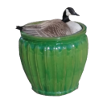

### The Github of the Jeffer

Welcome! I'm a CompSci student and hobbyist developer of random crap!

#### Repository Naming Convention
I like to name any proper repo after birds in the [Anatidae family of Waterfowl](https://en.wikipedia.org/wiki/Anatidae); Webgoose and Swanlake being prime examples!

